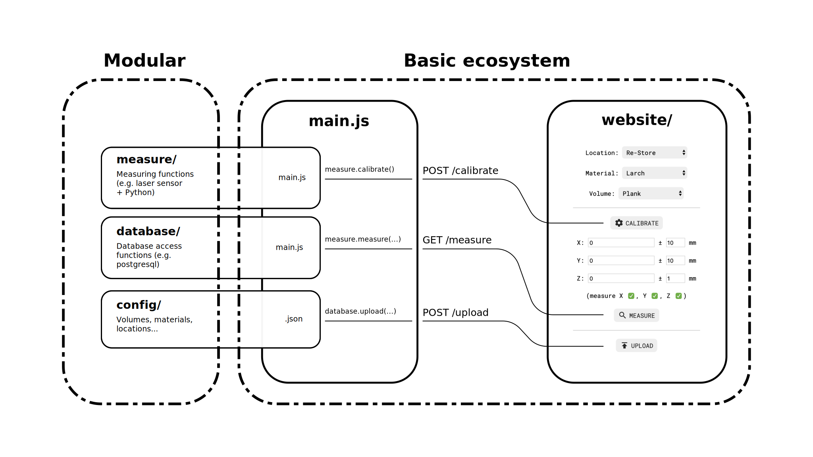

# La Dimensionneuse

## What is it ?

La Dimensionneuse is a device which can be used to measure and categorize random materials. 
It is being developped by WAO and WoMa. 

The idea behind the Dimensionneuse is to create a device that would allow us to reference wasted materials. 
Our goal is to encourage reusability of materials as far as architecture, design, and Building Information Modeling (BIM) are concerned.

## How to install

Clone this repo and install the dependencies :

```
npm install
```

Then, launch the dimensionneuse with :

```
node main.js
```

## Modularity

This project is conceived in a modular way : the website, the measuring process and the database are three independant parts. It makes it easy to use other sensors or another database.

<p align="center">
    
</p>

`main.js` is the entry point. It uses `Express` to setup a local website. Here are the different implemented requests :

- `GET /` (connecting to `localhost:3000`) serves the page in `website/`
- `POST /calibrate` calls the `calibrate` function in `measure/main.js`
- `GET /measure` calls the `measure` function in `measure/main.js`
- `POST /upload` calls the `upload` function in `database/main.js`

Edit `measure/main.js` and `database/main.js` to use your sensors and your database.
If you want to start from scratch, you can configure the dimensionneuse using [the wiki](https://github.com/Re-Store/Dimensionneuse/wiki).

## License

Project under Creative Commons Licence CC-BY 4.0.
